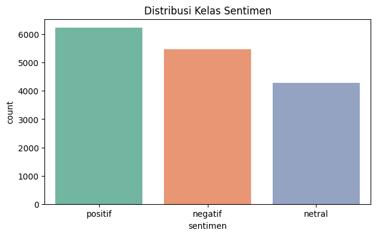

# Tokopedia Sentiment Analysis

An end-to-end sentiment analysis pipeline on **Indonesian e-commerce reviews** — scraped from Tokopedia, then classified into **positive / negative / neutral**.

  

## Overview

Two stages, each in its own notebook:

1. **Scraping** — [`1_scraping.ipynb`](./Analisis%20Sentimen/1_scraping.ipynb) collects raw product reviews and saves them to `dataset_tokopedia_mentah.csv`.
2. **Modelling** — [`2_pelatihan_model_final.ipynb`](./Analisis%20Sentimen/2_pelatihan_model_final.ipynb) cleans and labels the text, then trains a sentiment classifier over the three classes shown above.

## Tech stack

Python · pandas · scikit-learn · Sastrawi (Indonesian text preprocessing) · Matplotlib

## Notes

Sentiment-analysis submission for Dicoding's applied machine-learning track. Dataset and requirements live in the `Analisis Sentimen/` folder.
